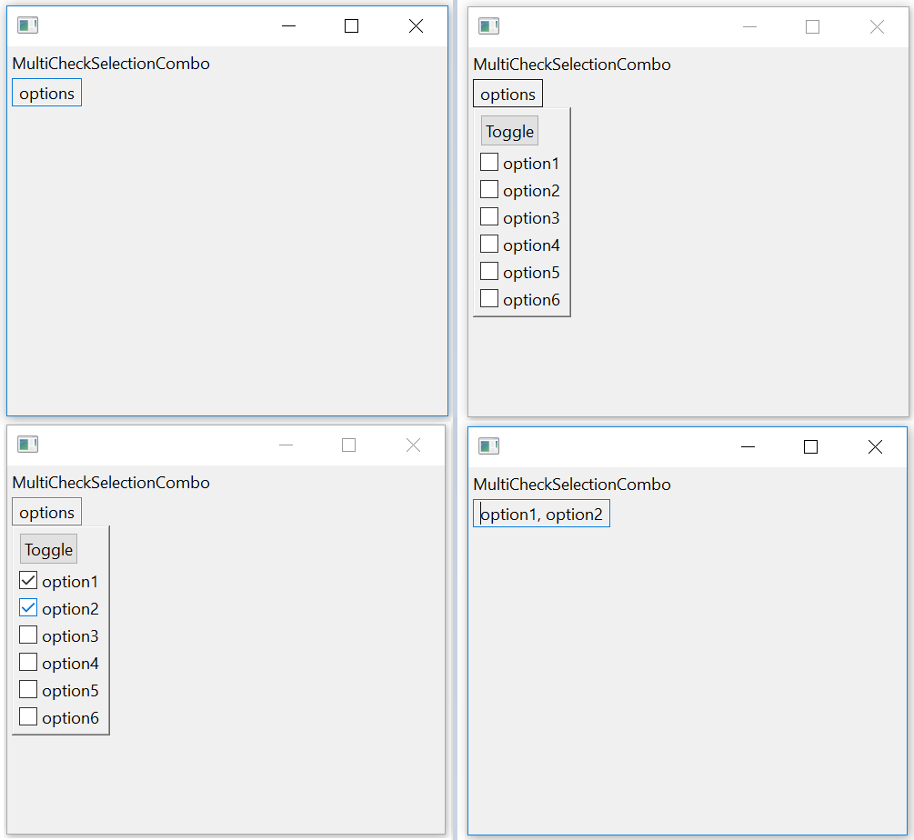

# SWTMultiCheckSelectionCombo
SWT widget that allows the user to select multiple items from a list of check boxes

SWTMultiCheckSelectionCombo is a composite similar to the Combo widget. It provides a list of check box style options on a floating shell. Users can select multiple options from the list, and the selection is displayed.ssdfsdf

The implementation aims to provide an API as similar to the Combo widget as possible. The API javadocs can be found below:
[a link](https://lawhcd.github.io/SWTMultiCheckSelectionCombo/)
